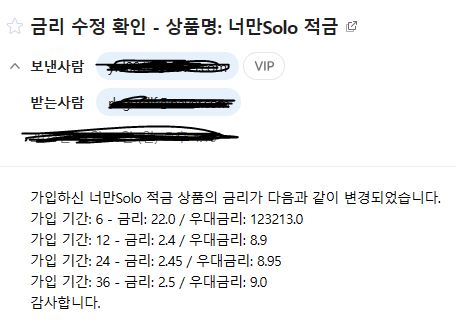

### SSAFY(삼성청년소프트웨어아카데미)로 부터 코드 반출 관련 허가가 승인되지 않아 상세 코드는 확인이 어렵습니다. 양해 부탁드립니다.

# SAM$UNG BVNK
## 프로젝트 개요
- 프로젝트 명 : SAM$UNG BVNK
- 팀원 : 김민준, 김혁일
- 시작 일시 : 23.11.15(수)
- 완료 일시 : 23.11.24(금)
- 기술 : Python, Django, Node.js, Vue-Pinia, Bootstrap

## 프로젝트 소개 및 주요 기능
- 여러 은행의 금융 상품을 한 곳에서 비교하고 보다 쉽게 가입하고 싶어하는 사람들을 위한 금융감독원 API를 활용한 예적금 상품 정보 공유.
- 한국 수출입 은행 환율정보 API를 활용한 실시간 환율정보 공유.
- Kakao Maps API를 활용해 원하는 위치의 은행을 검색 및 정보 습득 가능
- 협업 필터링을 활용해 사용자에게 맞는 상품 추천 알고리즘
- 게시판을 통해 다른 사용자들과 소통하고자 하는 소비자들을 위한 게시판 기능
- OpenAPI를 이용한 챗봇 시스템

### ERD

### 팀원과의 소통
- 노션을 이용한 일정공유 및 정리
notion Link\SSAFY Final Project.html

### 구현
- 메인페이지
- 회원가입
- 로그인

- 금융상품 페이지
  - 금리 순으로 정렬 가능
  - 특정 은행만 필터링하여 검색가능
  
  - 금융상품 상세페이지
    - 해당 상품 가입 시 저축금액을 보다 쉽게 예측 할 수 있도록 그 페이지에서 바로 이자계산이 가능한 기능 구현
      
    - 금융상품 담기 + SuperUser일땐 금리 변경가능 + 변경 시 가입된 사용자들에게 변경 내용 메일 발송
      

- 근처 은행 검색
  - 원하는 지역을 선택하면, 지도에서 해당 지역의 주변 은행들을 확인이 가능하며, 사이드바에 검색된 은행들의 추가정보 확인 가능
  

- 환율 계산기
  - 실시간 환율 정보를 이용해 한국 통화가 얼마의 가치를 가지는 지 환율 확인 가능
    

- 마이페이지
  - 사용자의 가입 정보 확인 및 수정가능
  - 사용자가 가입한 상품들의 금리를 그래프로 비교가능
    - 예/적금 상품의 금리 개월 수로 각각 비교가능
    
  - 상품 추천 알고리즘
    - 해당 사용자의 성향을 분석하지 않아도 패턴이 비슷한 다른 사용자가 있다면 그 사용자가 가입한 상품들을 추천해주는 알고리즘
    

- 챗 봇
  - 금융상품 서비스가 처음인 사용자들을 위해 챗봇 기능 구현

## 어려웠던 점 및 해결
- 카카오 맵 API를 활용하여 지도 구현
  - 카카오맵 API를 활용하여 지도를 구현하기 어려움을 겪음. 검색을 통해 알아보며 어떠한 역할을 하는 변수이며 자세히 분석하고, 추가적인 지역 검색기능을 추가하여 원하는 곳의 은행좌표들을 얻어 낼 수있었음. 사이드바를 통해 사용자의 가독성을 높였으며, 원하는 은행 지점을 클릭하면 그 곳의 좌표로 지도가 포커스되는 기능도 추가 구현함.

- 프론트엔드와 백엔드 통신의 어려움
  - 프론트엔드와 백엔드를 동시에 이용하여 개발한 경험이 전무하여 초기에 데이터 통신에 어려움을 겪음
    - 데이터 통신을 조금 더 간편하고 단순하게 하기 위해 django rest_api 구현하여 클라이언트의 요청에 따라 데이터 응답하도록 설계하였고, Axios 활용하여 비동기 통신 구현, 각 페이지에서 필요한 정보들만 서버로 요청하여 응답 받아 통신 비용 감소 효과 꾀함

- 디자인 감각의 부족
   - 디자인에 대한 학습 및 감각의 부족으로 초기 기획 당시 상세한 디자인 컨셉을 잡기 어려웠음
      - 초기에는 사이트의 방향성과 컨셉을 잡고 프로젝트 진행
      - 여러 금융 비교 사이트(뱅ㅋ샐러드, 핀다, 네이버 금융 비교) 등등 많은 서비스 디자인을 보며, 금융관련 서비스들은 고객들과의 신뢰가 중요하다 생각하였고, 군더더기없고 깔끔한 신뢰도 높은 디자인을 참고하여 레이아웃을 그렸고, 부트스트랩을 사용하여 부족한 디자인을 보안하였음

- 컴포넌트 명, 그들을 묶는 파일의 부족
  - 처음 계획을 세우기 전, 컴포넌트들이 많지 않을것이라 예상하고 진행하였다.
  - 하지만 기능상의 문제(chart.js가 선택하는 즉시 초기화를 해주어야하는 등, 예적금 상품의 특정 옵션이 다르다는 등) 컴포넌트들을 분배해주어야하였고, 이를 본인은 기존 경로들을 유지하기로 하고, 추가적인 페이지도 하나의 폴더로 묶지않고 그대로 추가하며 진행하였다.
  - 결과로는 Components파일 속 .vue파일이 수두룩해졌고, 폴더명 찾기도 번거로워졌다. 이를 통해 앞으로는 폴더관리를 더 세심하게 진행해야겠다 느꼈음.
  - 또한 팀원과 공유가 쉽게 되도록 변수명, 함수명을 이해하기 쉽게 정하기, 무슨 역할을 하는지 간단히 주석달기 등 나혼자만 개발을 하는게 아니라고 느꼈다.

## 프로젝트를 마치며
- 일주일이라는 짧은 기간동안 컨셉 기획, 디자인, 설계, 프로그래밍 등을 진행하는것이 다소 어렵게 느껴졌다. 팀원과의 의사소통을 통해 컨셉을 하나로 일치시켜 앞으로 나아갈때마다 뿌듯함이 생겼다. 이번 프로젝트를 진행하게 되면서, 학습했지만 아직 미숙한 기술스택, 내가 새로 배워야할 필요가 있는 기술스택 등 현재 나의 위치와 상황에 대해 뒤돌아볼 수 있는 계기가 되었다. 또한, 프로그래밍이 진행되면서 다른 개발자가 이해하기 좋고, 사용자 경험을 더 증진 시킬 수 있는 방법에 대해 조금 더 고민해볼 수 있는 시간이였다.